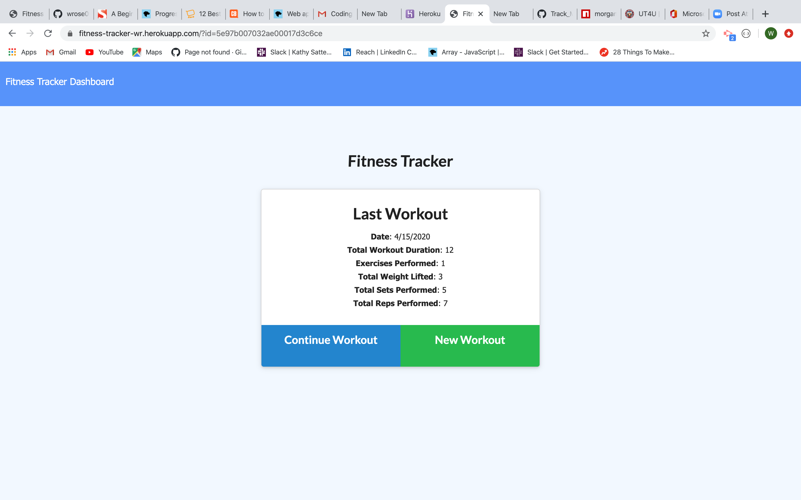
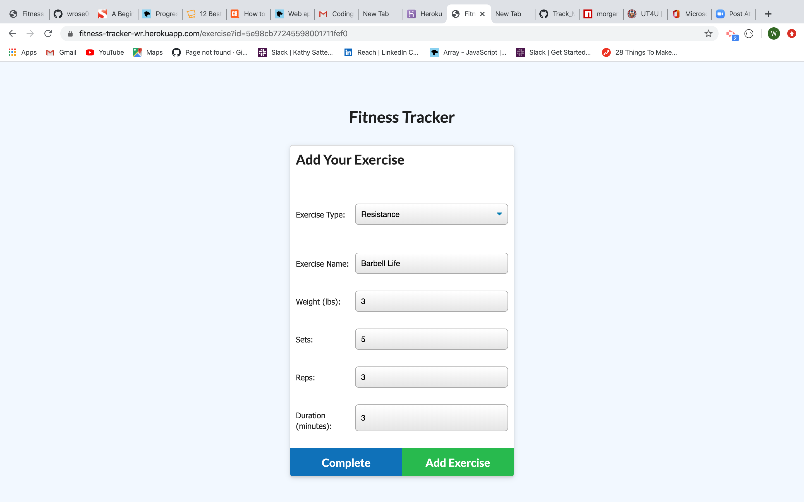
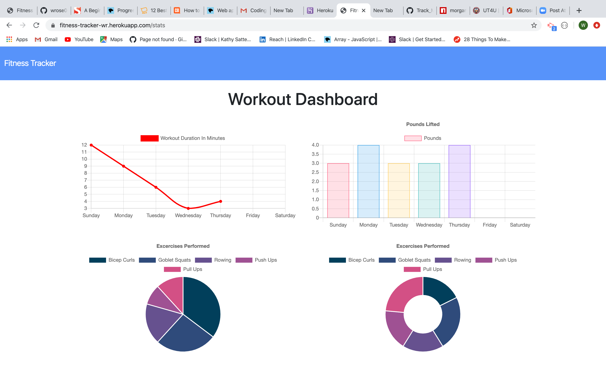

# Fitness-Tracker

This web application allows a user to create and track a daily workout. Multiple exercises can be logged in a give day. For resistance workouts, a user can track the name, type, weight, sets, reps, and duration of the exercise. For cardio workouts, a user can track the distance traveled, as well. These exercises are represented graphic in a series of graphs and charts on the dashboard.

### Included Files

* models folder
* public folder
* routes folder
* seeders folder
* package.json
* server.js
* README.md

## Deployment

[https://fitness-tracker-wr.herokuapp.com/?id=5e98cb77245598001711fef0](https://fitness-tracker-wr.herokuapp.com/?id=5e98cb77245598001711fef0)

## Images

 
 
 

## Built With

This app was built with a Mongo database, using a Mongoose Schema. Routes are handled through Express and Morgan serving as middleware. The app has been deployed on Heroku. It should also be noted that the frontend code was provided.

## Contributing

Pull requests are welcome. For major changes, please open an issue first to discuss what you would like to change.

Please make sure to update tests as appropriate.

# Acknowledgments

Many thanks to my tutors, Tammy and Sai, as well our TA, Owais, and Calvin, my instructor, for help with MongoDB, setting up the routes, and deployment on Heroku.

# Fitness-Tracker